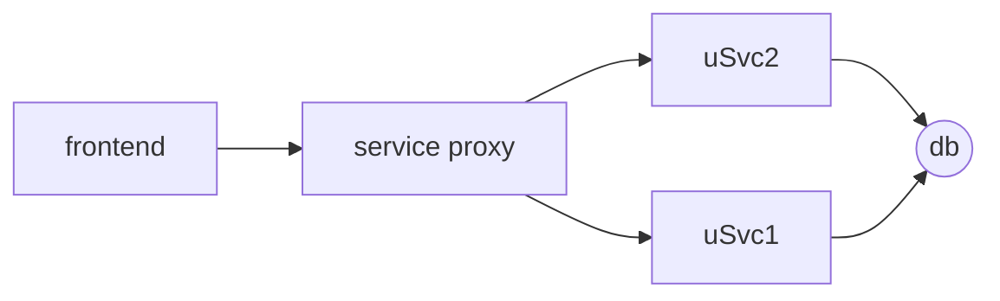

<!--
PostId: 403654636707498568
Title    : Feature branches vs feature flags
Labels   : devops, microservices
Format	 : markdown
Published: true
filters: mermaid-filter.cmd
-->
Of late, we've been working with more and more customers adopt a more DevOps friendly culture and engineering practices.
While customers love what they hear about DevOps, esp that it lets you ship features sooner out of the door and shorten
feedback cycles, my experience with customer organizations has been somewhat a mixed bag in terms of true on the ground adoption.

A recent experience that has gotten me thinking is about feature branches vs feature flagging. On a large distributed
software engineering effort, we moved a bunch of services from a monolithic svn repo (single project) to multiple git
repos which publish nuget packages of components that get consumed elsewhere. We also suggested creating feature branches
for each ticket/work item and then merging often. This works well if changes are limited to a single service - however,
when you have changes across services that need to be coordinated, it's not sufficient on it's own.

One of the things that modular repos led to is that the teams were struggling with shipping code in sprints even after a decent time given for adjustment to process changes. On two week sprints, multiple sprint teams were working on different features that
all affected the same set of services - towards, the end of the sprint, there'd be a mad rush to merge in PRs -
and once one team merged their PRs, the others would have to pull in changes from master and deal with merge conflicts
at the fag end of the sprint. This usually led to a lot of stress at the last minute with stories being slipped
over to the next sprint.

One of the factors causing this was that it was a legacy system where services were coupled with a single database at the
bottom (oops!)- this made cross functional features affect the same set of services over and over again, leading to contention
and merge hells. However, even without that particular wrinkle, cross functional features that affect multiple services
are harder to ship completely within a single sprint since a feature release must coordinate changes across multiple service
repositories. Add automation, unit testing, QA validation and so on, and very soon, 2 weeks doesn't seem enough.
When that happens, you end up with feature branches sitting out on dependent repositories that cannot be
merged into master since the feature isn't done and now someone has to keep the branch in sync with master as new features
and bug fixes get merged into master. Added to that, since the feature branch has been sitting out of master for a longer
period of time, merging is more complicated since the changes are more.

Reflecting back, I feel at least for cross functional features, having feature flags is an absolute must - this would
have allowed teams to break down feature development into multiple sprints and merge enabling services/apis into master
without worrying about shipping incomplete code. It also would have reduced the burden of keeping branches in sync. OTOH,
it would have increased the burden of keeping feature flags in check and ensuring that they don't run wild. Furthermore,
it's conceivable that you'd need a central way of managing sets of feature flags across multiple services... so that a single
end user functionality can be toggled by affecting a composite feature flag rather than twiddling a bunch of flags across
different services individually.

Looking for feature flag libraries, there don't seem to be enough good open source options in the .NET world. On Java
however, there seem to be a few good candidates - with  [ff4j](http://ff4j.org/) leading the pack.

In summary, microservices are great - however, when you're migrating legacy code, think long and hard about how you'd like
to handle cross functional changes that affect multiple services without impacting your agility to ship. Feature branches
are only part of the solution - consider feature flagging as well so that you can build cross functional features in stages.
Also, keep in mind that Feature flags aren't free - they add their own burden - but with a good engg governance around
limiting the number of feature flags and how they're phased out, you should be in good hands.
