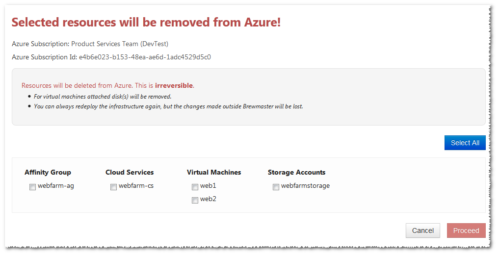
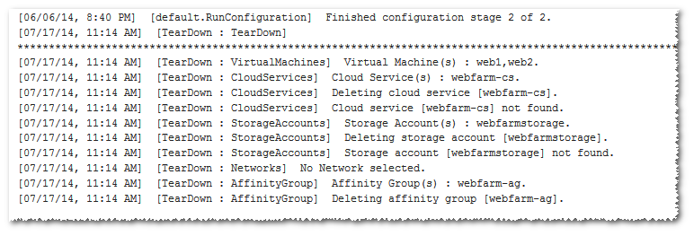
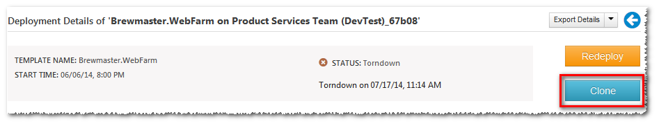
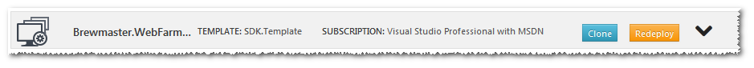
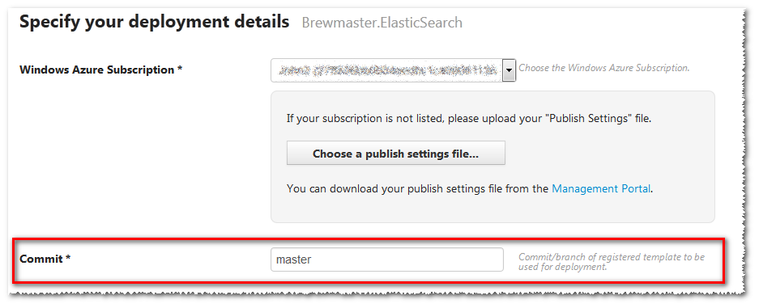
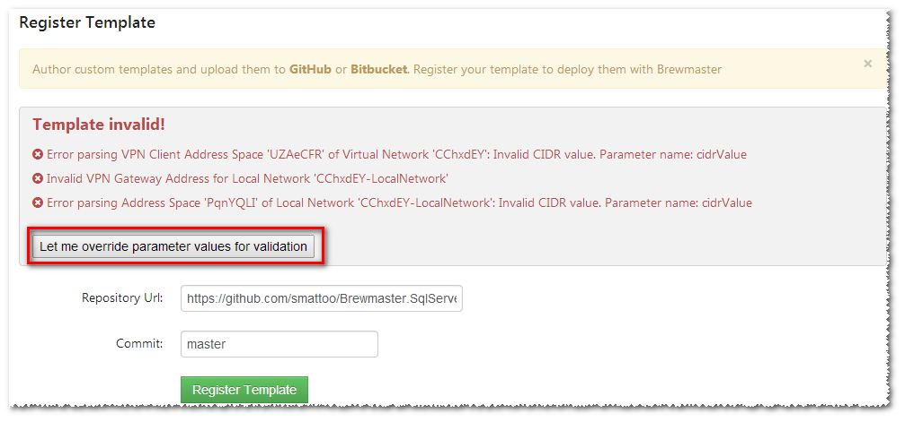

#It's raining goodies at Brewmaster

## A quick recap

Since the [Template SDK](https://www.aditicloud.com/documentation/brewmaster?page=Toc#possibilities) roll out, things have been busy. It's been amazing to see users use Template SDK to build out custom IaaS environments on Azure. What's been even more gratifying to  templates that heavily make use of the flexibility available in the template syntax. Supporting users with really 'out there' template customization requirements has both been incredibly fun as well as eye opening. To be honest, we were pretty sure that  it'd be a long time before developers venture into dynamic template features. Just goes to show how wrong you can be when one of the first feedback emails was someone trying to use liquid filters in their template!

## Show me the goodies
But then, I digress; I wanted to use this post to introduce new features that we pushed out to [Brewmaster](http://www.aditicloud.com) in the last few weeks. So, without further ado, let's jump in:

###Teardown deployed infrastructure
Deployed an environment using Brewmaster and now want to get rid of it? Absolutely. This has been one of the most asked for features - but one of those things that are hard to get right. What if you've created your own tables in a storage account provisioned by Brewmaster? At one end, there's the convenience of being able to teardown a complete deployment and everything that it entails. On the other hand, there is genuine concern we could end up doing more damage than good - especially if the end user doesn't fully understand the implications of a teardown. 

We've finally settled on a middle ground that I think will be mostly appropriate for everyone. When you teardown an environment, we show you a preview and you have to explicitly select what you need to teardown.

1. Head over to the deployment details page and click the teardown button. 

2. You will see a preview of the infrastructure deployed by the template and you can select resources you'd like to delete. Select and hit 'Proceed'. 

3. You will be asked to confirm once more and then Brewmaster starts deleting infrastructure from your azure subscription with logs showing up under the deployment.

###Clone a deployment
Just deployed SSAO to your dev environment and now need to deploy it to your production subscription with the almost all of the same parameter values? Earlier, you had to create a new deployment configuration and manually enter in all the values while keeping track of the ones that should be changed. 

Not any longer!

You can now start with a deployment (or a configuration) and create a new configuration with all the same values copied over. Just modify the ones that are different and you now have a new configuration that can be deployed many times over.

###Use a different commit at deployment
Earlier, when you deploy a registered template, it would default to using the commit used while registering the template. This proved a little problematic when you start a new branch and then realize that to use that branch, you have to register the template again. 
Not so anymore.
Now you when you start a deployment, you have the option to provide a branch name or a commit sha and Brewmaster will pull that revision for the deployment!

###Better Template validation
Template registration now runs a whole slew of validation rules on your template before registration. This makes sure that you catch errors early. Nothing more irritating than registering a template, then start a deployment and see it fail due to a pesky trailing comma in the template json.

The validation process guesses values for parameters specified in the template. Sometimes, you might have a parameter defined as a string but used in a context where it's interpreted differently (say as an IP address). The parameter generator does not know about this and hence it might lead to false positives. Obviously, not a good situation - so you also have the option of manually specifying values to be used for validation - just click the button above and you can override any of the automatically generated parameters. If the validation succeeds with your overridden paramters, then the template is considered valid and registration goes through successfully.

###Elasticsearch Template
A new Elasticsearch template has been added. You can now have a scalable, Azure aware Elasticsearch instance in minutes. We started using Elasticsearch internally and what better way to show our appreciation than to make a template out of it. The Elasticsearch template deploys into Windows Azure IaaS with automatic node discovery. Just specify the number of Elasticsearch servers and the disk size and Brewmaster will do the rest.

## Till next time
That's it for now, folks. We've got a lot of good things lined up - template sharing and discovery, private template repositories and more. Feel free to drop us line if you have a feature or idea that you'd like to see. Or  if you just want to tell us how we're doing! Write to us at [support@aditicloud.com](mailto:support@aditicloud.com) 

