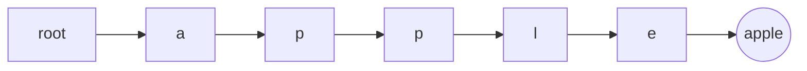
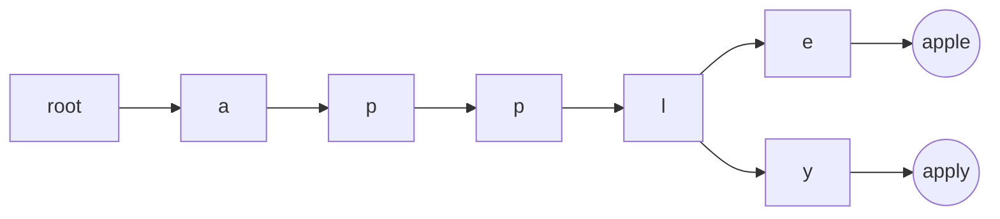
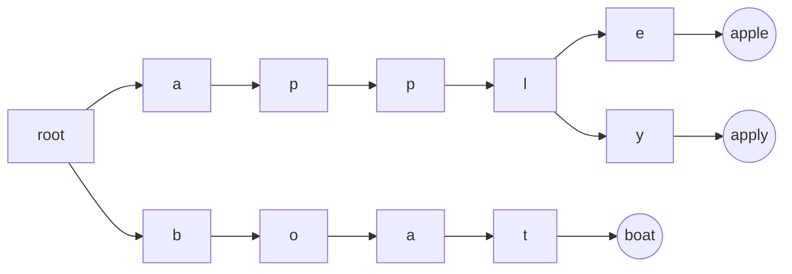

<!--
PostId: 8849300945914007919

Title    : A C# Trie implementation

Labels   : datastructures, csharp, .net

Format	 : markdown

Published: true

filters: mermaid-filter.cmd
-->
### What's a trie?

A trie is a datastructure that's optimized for prefix retrieval. It's basically
a prefix tree with each node being the letters seen till that point. For
example - A trie with `apple`



Now if we add `apply` to the tree above, we get:



What if we add something without a common prefix - say `boat`



I needed a trie recently and was checking Nuget for available libraries -
surprisingly there aren't too many datastructure libraries available for .net
on nuget. I found [VDS.Common](https://www.nuget.org/packages/VDS.Common/)
which seems to be most popular at 36K downloads.

Anyway, after using VDS.Common and getting around 700ms search time for
distinct search results over a dataset, I thought I'd give writing my own a
shot to see if I could do better.

Here's the base interface:

```csharp

 public interface ITrie<in TK, TV>
    {
        IEnumerable<TV> Find(IEnumerable<TK> keyprefix);
        void Add(IEnumerable<TK> key, TV value);
    }
```

Next, we model a trie node - this keeps links to child nodes and at the leaf
level, a reference to the data we want to store in the trie.

```csharp
 class TrieNode<TK, TV>
    {
        private TK keyBit;
        private TV value;
        private IDictionary<TK, TrieNode<TK, TV>> children;

        public TrieNode(TC ch, TV value)
        {
            this.keyBit = ch;
            this.value = value;
            this.children = new Dictionary<TK, TrieNode<TK, TV>>();
        }

        public IDictionary<TK, TrieNode<TK, TV>> Children
        {
            get { return children; }
            set { children = value; }
        }

        public void Add(IEnumerable<TK> keySeq, TV value)
        {
            var node = this;
            foreach (var ch in keySeq)
            {
                if (node.children.ContainsKey(ch))
                {
                    node = node.children[ch];
                }
                else
                {
                    var newNode= new TrieNode<TK, TV>(ch, default(TV));
                    node.children[ch] = newNode;
                    node = newNode;
                }
            }
            node.value = value;

        }

        public IEnumerable<TV> GetValues()
        {
            var stack = new Stack<TrieNode<TK, TV>>();
            stack.Push(this);
            while (stack.Count > 0)
            {
                var node = stack.Pop();
                if (node.value != null)
                    yield return node.value;
                foreach (var kv in node.Children.Reverse())
                {
                    stack.Push(kv.Value);
                }

            }
        }
    }
```

Finally, let's have a concrete implementation of `ITrie`

```csharp
    public class Trie<TK, TV> : ITrie<TK, TV>
    {
        private TrieNode<TK, TV> root;

        public Trie()
        {
            this.root = new TrieNode<TK, TV>(ch: default(TK), value: default(TV));
        }

        public IEnumerable<TV> Find(IEnumerable<TK> keyprefix)
        {
            var node = this.root;
            foreach (var ch in keyprefix)
            {
                if (node.Children.ContainsKey(ch))
                {
                    node = node.Children[ch];
                }
                else
                {
                    return Enumerable.Empty<TV>();
                }

            }
            return node.GetValues();
        }

        public void Add(IEnumerable<TK> key, TV value)
        {
            this.root.Add(key, value);
        }
    }
```

On the same dataset, I get < 500ms over VDS.Common. Admittedly,
this is less full featured, but I can live with that.
